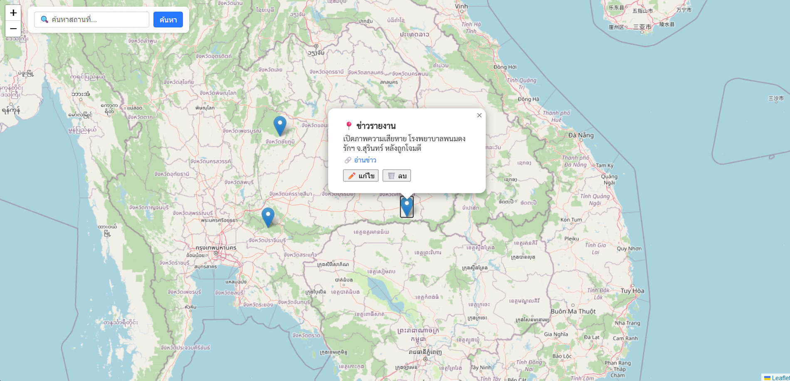

# 🛡️ Border Alert Web App

**A real-time alert web application for border conflict incidents between Thailand and Cambodia** — featuring interactive maps with pinpoint markers using Leaflet (OpenStreetMap).



---

## 🔎 Key Features

- Display Thailand map with incident markers  
- Add news reports with geographic coordinates  
- Attach external news links  
- Edit existing reports to correct mistakes  
- Delete markers if the information is incorrect  
- Search for specific locations  
- Real-time updates using **Socket.io**  
- Store all data in **PostgreSQL**

---

## ⚙️ Installation (Local Development)

### 1. Clone the repository

```bash
git clone https://github.com/dewzdewzdewz/border-alert-app-by-dewzdewzdewz.git
cd border-alert-app
```

### 2. Create the PostgreSQL database

```sql
CREATE DATABASE postgres;
```

Then run the schema:

```bash
psql -d postgres -f server/db/schema.sql
```

### 3. Configure environment variables

Create a `.env` file in the root directory:

```env
PG_USER=postgres
PG_PASSWORD=yourpassword
PG_HOST=localhost
PG_PORT=5432
PG_DATABASE=postgres
```

### 4. Install dependencies

```bash
npm install
```

### 5. Run the application

```bash
npm run dev
```

---

## 💬 About This Project

This project was created by **Nitipon Khachornphop** to help the public stay informed about unrest and conflict situations along the Thailand–Cambodia border.

It is **non-commercial**, developed and shared solely for public benefit.

📬 Suggestions or feedback?  
Email: `nitiponkhachornphop@gmail.com`

---

## ⚖️ License

This project is licensed under the **MIT License**.  
You are free to use, modify, and distribute this code — just remember to give credit.
